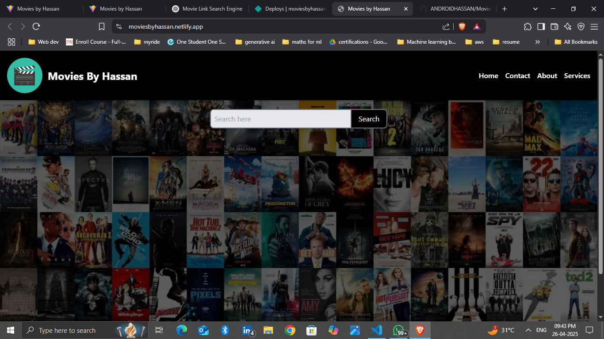
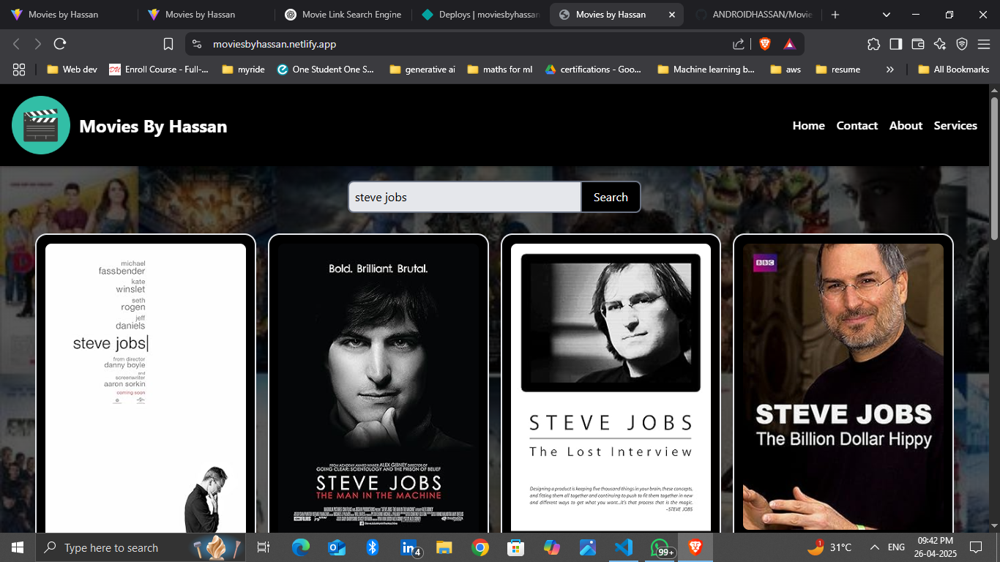

# 🎬 Movie Finder - Search Your Favorite Movies Instantly!

Welcome to **Movie Finder**, your one-stop solution for finding movies from multiple sources across the internet!

## 🚀 About the Project

Finding movies online is frustrating — tons of ads, multiple websites, and endless searching.  
**Movie Finder** solves this problem by providing a single platform where you can:
- 🔎 Search any movie by name.
- 🌐 Get instant links from different sources (YouTube, other websites, Telegram, etc.).
- ⚡ Fast, simple, and ad-free movie search experience!

Whether you want to watch a trailer, find streaming options, or download movies, **Movie Finder** saves your time and energy!

---

## 🛠️ Built With

- **React.js** (Frontend Framework)
- **Fetch** (for API requests)
- **Movie Database API** (or your custom source)
- **Tailwind CSS** (for styling)

---

## 📸 Screenshots

| Home Page | Search Results |
|:---------:|:--------------:|
|  |  |

---

## 🚀 How to Run Locally

1. Clone the repository:
   ```bash
   git clone https://github.com/yourusername/movie-finder.git
